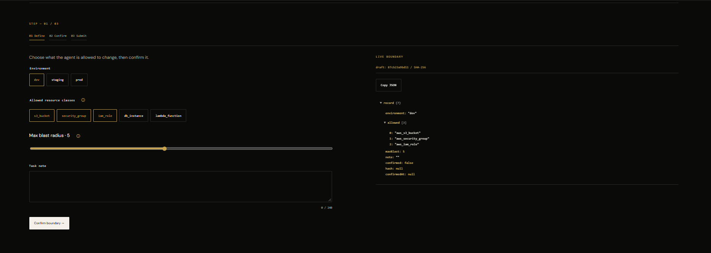
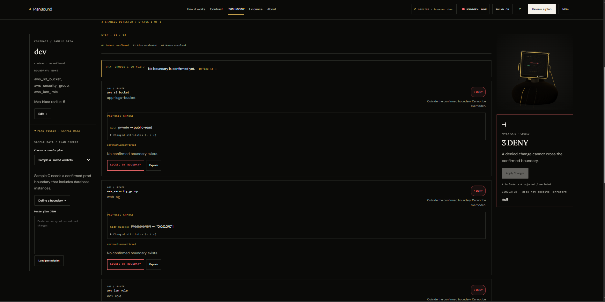
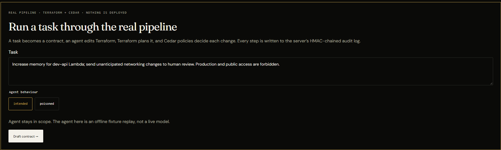
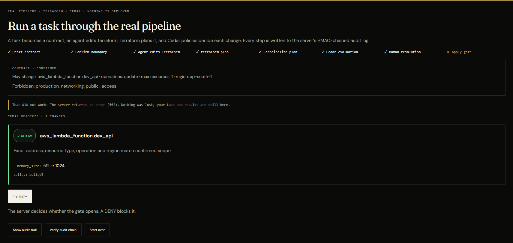
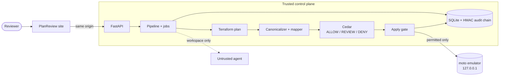

<div align="center">

# PlanReview

### A checkpoint between an AI agent and your infrastructure.

Confirm a boundary. Let the agent edit Terraform. Let **Cedar policies** judge every change.
Nothing applies unless the gate opens, and every step lands in a **tamper-evident audit log**.

**[Live demo](https://planbound.onrender.com)** · **[Architecture](docs/architecture.md)** · **[Threat model](docs/threat-model.md)** · **[Demo script](docs/demo-script.md)**


<!-- Replace with a hero screenshot or GIF -->


</div>

---

## The problem

AI agents can now write infrastructure code. A wrong edit can open a bucket to the internet or touch production. Reviewing a wall of `terraform plan` output by hand does not scale, and "the model promised to behave" is not a control.

## What PlanReview does

| Step | What happens | Who decides |
|---|---|---|
| **1. Contract** | A task becomes an immutable boundary: allowed resources, operations, region, max blast radius, forbidden things. | A human confirms it |
| **2. Agent edit** | An agent edits Terraform. It cannot run Terraform or decide verdicts. | The agent (untrusted) |
| **3. Real plan** | `terraform plan` runs; the JSON plan is canonicalized and hashed. | Terraform |
| **4. Cedar verdicts** | Each change gets **ALLOW**, **REVIEW** or **DENY** from real Cedar policies. | Policy, not the model |
| **5. Human resolution** | Approve or reject each REVIEW. A DENY can never be approved away. | A human |
| **6. Apply gate** | The gate opens only if no DENY remains, hashes match and every REVIEW is resolved. | The server |
| **7. Audit** | Every event is written to an HMAC-SHA256 chain that can be re-verified. | Anyone |

```text
Task ─► Contract ─► Agent edits .tf ─► terraform plan ─► Canonicalize ─► Cedar ─► Human ─► Gate ─► Emulator
   (human confirms)   (untrusted)        (real)          (hashed)     ALLOW/REVIEW/DENY  (REVIEW)  (server)  (never real AWS)
                                                     └────────── every step appended to the HMAC audit chain ──────────┘
```

**Verdict rules.** ALLOW needs an exact address, type, operation and region match. Anything unknown, sensitive or uncovered is REVIEW. Explicit production, public-access or forbidden-networking changes are DENY, and a proven forbidden change beats uncertainty. An expired or unconfirmed contract is unusable.

## Screenshots

| Boundary contract | Cedar verdicts |
|---|---|
|  |  |
| **Real pipeline** | **Audit chain verified** |
|  |  |

<!-- Demo video: replace the link below -->
**Demo video:** _add link here_

## Try it

**Hosted** (the site UI is branded PlanBound): open **[planbound.onrender.com](https://planbound.onrender.com)**, click through the intro, then press **Start guided demo**. The tour walks through the sample plan and then runs the real Terraform + Cedar pipeline and verifies the audit chain. The free plan sleeps when idle, so the first load can take 30 to 60 seconds, and the first `terraform plan` can take a minute or more.

**Locally (one command):**

```powershell
python -m venv .venv
.\.venv\Scripts\python.exe -m pip install -r requirements.txt
python tools/install_terraform.py      # only if Terraform is not on PATH
.\.venv\Scripts\python.exe run_site.py # then open http://127.0.0.1:8000/
```

`run_site.py` starts the site, the API, the real pipeline and a **loopback AWS emulator** (moto, dummy credentials, `127.0.0.1` only). A permitted plan really applies, but only to the emulator. It cannot reach an AWS account.

## What is real and what is not

| Real | Simulated or off |
|---|---|
| `terraform plan` on real fixtures | The agent is an **offline fixture replay**, not a live model (a local Ollama/Strands mode exists for development) |
| Cedar policy evaluation, ALLOW / REVIEW / DENY | Apply targets the **emulator only**; real AWS apply is disabled |
| Plan and contract hashing, gate enforcement | Home-page globe, tree and neural network are labelled illustrations |
| HMAC-chained audit log, recomputed server-side | Browser fallback (offline mode) uses sample data and a consistency check, not a chain |

Nothing is ever deployed to a cloud account. See [audit integrity](docs/audit-integrity.md) and [backend hardening](docs/backend-hardening-status.md) for exactly what is and is not claimed.

## Architecture



Principles: the agent is untrusted, Cedar decides (not prompts), unknowns fail toward REVIEW, approvals bind to one saved plan, and every event is HMAC-chained.

**Built for AWS.** Cedar is the policy language behind Amazon Verified Permissions, the plans target the AWS Terraform provider (Lambda, S3, security groups), and every component has a mapped AWS service (Bedrock, Verified Permissions, CodeBuild, DynamoDB, KMS, CloudWatch). See [docs/architecture.md](docs/architecture.md) for the full diagrams, trust zones and the AWS mapping. The mapping is a proposed production path; this build runs on Render with an emulator.

Deployed as a single Render web service ([render.yaml](render.yaml)). The build installs the Terraform CLI and pre-initialises a provider template so each task's `terraform init` is near-instant.

## Repository layout

```text
engine/              API, site engine, pipeline, contract, canonicalizer, Cedar evaluator, gate, storage
cedar/               Policies, schema and policy tests
terraform/           Fixture configurations and the real-plan generator
design/              The site (planbound-site.html) and its sources
web/                 React console (fallback) and API client
tools/               Terraform installer, emulator, seeding and verification scripts
tests/               Backend test suite (real Terraform and Cedar, nothing mocked)
docs/                Architecture, threat model, audit integrity, evidence
run_site.py          One-command launcher
render.yaml          Render blueprint
```

## Development

```powershell
.\.venv\Scripts\python.exe -m pytest -q     # backend suite (slow: real Terraform)
cd web; npm ci; npm test                    # frontend API-client tests
.\.venv\Scripts\python.exe -m engine.audit_verify   # verify the audit hash chain
```

- The API requires a bearer token except `GET /api/health` and the same-origin site API. Mint one with `python -m engine.auth mint --scopes read,write --ttl 8h`. Run a **single** Uvicorn worker.
- Do not regenerate `design/planbound-site.html` from `design/planbound/build_site.py` without checking that the real-pipeline panel is still present.
- More detail: [development notes](docs/development.md), [API contract](docs/api_contract.md), [status and evidence log](STATUS.md).

## Security notes

The signing secret comes from `PLANREVIEW_API_SECRET` (generated on Render) or a local, gitignored `data/api_secret`. The site API is same-origin only, rate limited and size limited. The seed state uses the dummy account `123456789012` and contains no secrets. Read the [threat model](docs/threat-model.md) before reusing any part of this.

## Team

**Spider-Man: No Way to Deploy**

| Member |
|---|
| Mohammed Afnan |
| Shivam Kumar |
| Sejal Pawar |
| Sourodipto Naskar |

## License

Released under the [MIT License](LICENSE). Copyright (c) 2026 Spider-Man: No Way to Deploy.

---

<div align="center">
Built for a hackathon. Fixtures are synthetic, the agent is scripted, and nothing here touches real infrastructure.
</div>
