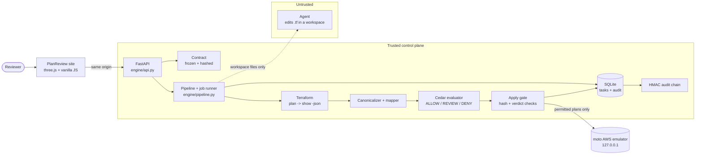
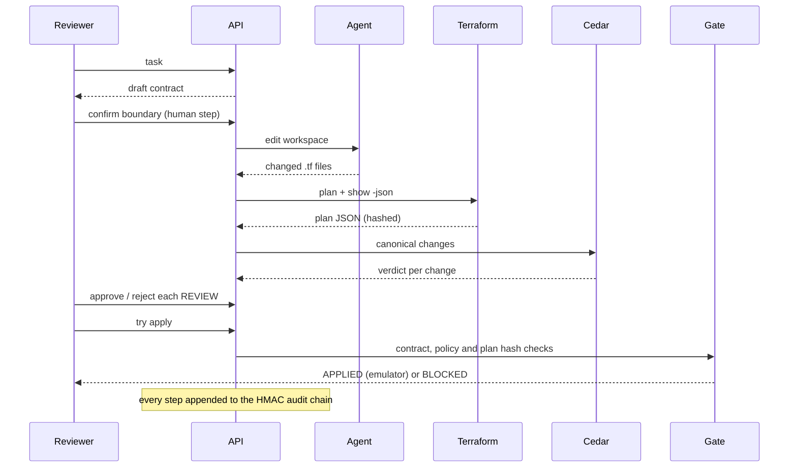

# Architecture

PlanReview is a policy checkpoint between an AI agent and AWS infrastructure. The agent proposes Terraform. It never holds authority: a human-confirmed contract defines the boundary, Cedar policies decide each change, and a server-side gate enforces the result before any apply.

## Design principles

1. **The agent is untrusted.** It can edit files in a task workspace. It cannot run Terraform, choose verdicts or widen its own contract.
2. **Policy, not prompts.** Verdicts come from Cedar, the same policy language behind Amazon Verified Permissions. No model output decides ALLOW, REVIEW or DENY.
3. **Fail toward REVIEW.** Unknown resource types, unprovable regions, sensitive values and evaluator errors become REVIEW, never ALLOW.
4. **Bind approvals to evidence.** Approvals attach to one saved plan. A new plan clears them. The contract, policy and plan hashes are re-checked before apply.
5. **Everything is auditable.** Each event is appended to an HMAC-SHA256 chain that anyone can re-verify.
6. **No real cloud writes.** Permitted plans apply only to a loopback AWS emulator.

## System view

## Request lifecycle

## Trust zones

| Zone | Components | Trust |
|---|---|---|
| Untrusted | Agent output, pasted plans, browser input | Validated, size limited, never authoritative |
| Trusted control plane | Contract, canonicalizer, mapper, Cedar, gate, storage | Decides and records |
| Isolated target | moto emulator on loopback with dummy credentials | Only place an apply can land |

## Mapping to AWS (production path, proposed)

This build runs as one Render service. It is designed so the components map onto AWS services. Only the AWS Terraform provider and an emulated endpoint are used today; the rows below are a design, not a deployed system.

| PlanReview component | Today | AWS target |
|---|---|---|
| Agent | Offline fixture replay (optional local Ollama) | Amazon Bedrock agent with a scoped role |
| Policy evaluation | Cedar native binding | Amazon Verified Permissions (Cedar) |
| API and pipeline | FastAPI on Render | AWS Lambda or ECS Fargate behind API Gateway |
| Terraform runs | Subprocess in a workspace | AWS CodeBuild in an isolated project |
| Task and audit storage | SQLite | DynamoDB, with the audit chain anchored in S3 Object Lock |
| Signing secret | Env var | AWS Secrets Manager with KMS |
| Apply target | moto emulator | Sandbox account assumed via a least-privilege IAM role, after the gate opens |
| Logs and alerts | stdout | CloudWatch Logs and metric alarms on BLOCKED and DENY |

## Data boundaries

1. **Contract:** a frozen Pydantic model with immutable tuple collections. Draft contracts are inert. Confirmation validates concrete deny categories and expiry. The server refuses subsequent changes.
2. **Edits:** offline fixture replay or optional live Strands file tools in a task-specific workspace. The contract is never supplied to the editing agent as negotiable authority. Provider changes and executable Terraform constructs are rejected before planning; this is a limited fixture guard, not a general sandbox.
3. **Terraform:** subprocesses with timeouts and captured output. Fixture state is constructed explicitly; all plan JSON comes from `terraform show -json`. Every task keeps a saved binary plan, raw JSON, hashes, and command output.
4. **Canonicalizer:** filters no-ops, pairs replacement actions, preserves exact indexed addresses, recursively compares attributes, redacts sensitive values, retains unknown flags, extracts region and environment evidence. Unsupported resources and malformed inputs become unknown REVIEW items.
5. **Mapper:** converts canonical changes into Cedar context facts. It identifies supported public-access-control weakening, production tags, and networking categories. It does not assign verdicts.
6. **Evaluator:** policies live in `.cedar` files. Cedar Allow becomes ALLOW; Deny with determining forbid policies becomes DENY; Deny with empty determining policies becomes REVIEW. Diagnostics errors also become REVIEW. The deterministic implementation remains available explicitly for regression tests. There is no silent Cedar-to-ALLOW fallback.
7. **Run limits:** aggregate resource count and unverifiable cost caps turn otherwise allowed items into REVIEW. Explicit DENY remains DENY.
8. **Apply:** checks active contract, DENY, unresolved/rejected REVIEW, policy hash, and saved-plan hash before subprocess creation. Only local `terraform_data` execution is enabled in this build. Terraform itself rejects stale state on saved-plan apply.
9. **Persistence:** SQLite stores task snapshots and append-only application events transactionally. Raw plan files are retained locally and raw plan content is also included in new plan audit events. The filesystem/SQLite owner remains trusted.

## Processes

FastAPI serves the production React bundle and JSON API. Terraform and Cedar's native binding execute on the backend; Cedar does not require a daemon. Vite is optional for frontend development. Task writes are optimistic compare-and-set on a version column, so several API processes can share one database; long operations run as durable background jobs (see `docs/backend-hardening-status.md`, item F).

## Supported limits

This release targets the supplied Lambda, SG, bucket, and S3 public-access-block fixtures. It is not a complete classification system for every AWS resource or embedded policy document. New types fail toward REVIEW. Region expressions that cannot be proven statically also require review. Sensitive values are redacted in canonical views; raw Terraform evidence remains sensitive local data.
